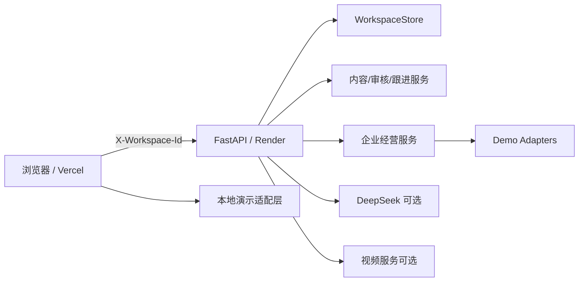
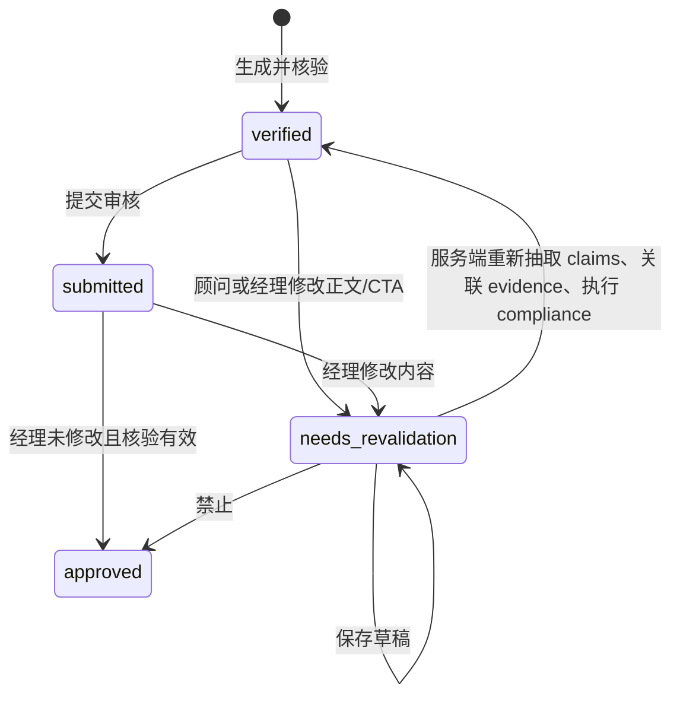
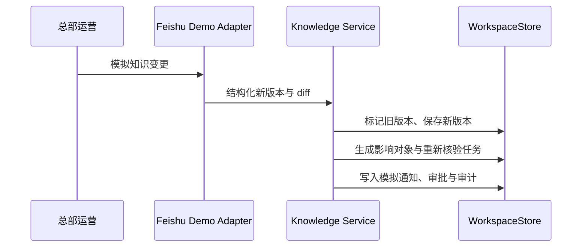

# 架构说明

## 1. 总体结构

项目保持 React 18、TypeScript、Vite 和 FastAPI，不引入大型后台框架。

## 2. 前端模块

- `frontend/src/app`：全局 Provider、角色空间、路由和壳层。
- `frontend/src/pages`：页面组合层，包括原有页面及热点、知识、客户 360、承诺、质量、优秀案例、客户风险、效果验证和治理。
- `frontend/src/features`：内容编辑、事实溯源、风险标注、跟进和批量任务等可复用业务能力。
- `frontend/src/shared`：Demo 数据、工作流纯函数、UI 基础组件和离线适配。
- `frontend/e2e`：跨页面业务闭环测试。

前端首次访问生成 UUID 并保存到 `localStorage`，所有 API 请求由 `api.ts` 统一携带 `X-Workspace-Id`。

## 3. 后端模块

- `workspace.py`：工作区模板深复制、隔离、TTL、线程安全、重置、原有审核与跟进状态。
- `content_engine.py`：规则内容、claims、evidence 和合规结果。
- `enterprise.py`：热点、知识影响、客户行动、承诺、质量、辅导、案例、风险和场景状态转换。
- `integrations.py`：飞书、CRM、授权沟通渠道、趋势 Demo Adapter。
- `main.py`：Pydantic 请求校验和 HTTP 路由；服务端重新确认负责顾问、审核状态和 workspace。

## 4. 可信内容状态机

核验记录保存版本、知识版本、时间和方式。历史已发送内容不静默替换，只保留当时知识版本。

## 5. 企业知识变化

## 6. 销售质量流程

质量信号只表示“待复核”。对象保留原始沟通、触发规则、系统解释、员工说明和经理决定。经理可选择无需处理、提醒、辅导、培训、观察或记录“需进入企业正式流程”；本系统不执行处罚。

## 7. Demo Adapter

每个 Adapter 返回结构化数据并参与真实状态变化：

- Feishu：知识变更、通知、审批。
- CRM：客户资料、阶段、负责人和同步冲突。
- Messaging：顾问发送、客户回复和授权渠道来源。
- Trends：模拟公开趋势和区域事件。

生产占位只定义环境变量、Webhook 和映射边界，不伪装已接入。

## 8. 数据持久化边界

当前每个 workspace 的状态保存在服务进程内，刷新保留、进程重启或 TTL 到期后恢复模板。生产化建议：

- PostgreSQL 保存业务对象和不可变审计事件；
- Redis 保存会话、锁和 TTL；
- 对象存储保存合规允许的附件；
- 企业 IAM / RBAC 替代“角色演示”。

## 9. 故障与 fallback

- 后端不可用：前端切换明确标记的本地演示状态。
- 模型不可用：规则内容和事实库 fallback，不显示为模型结果。
- 视频服务未配置：只保存脚本和分镜，状态为 preview。
- Adapter 未配置：保持 demo 或 placeholder 状态，并显示“未连接生产系统”。
