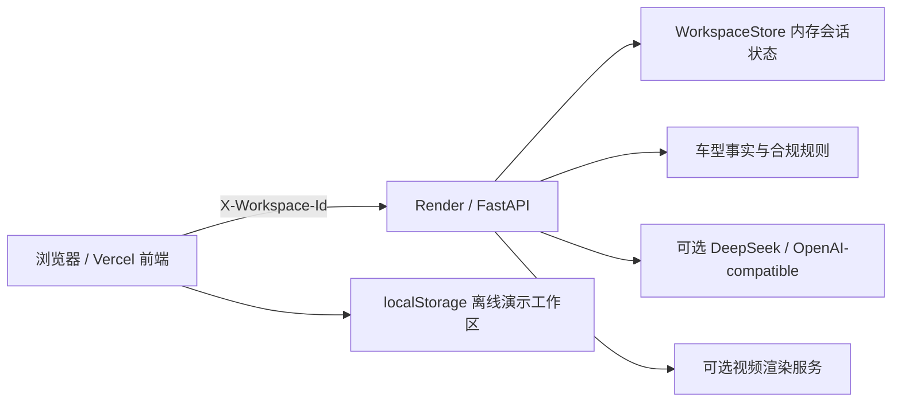

# ONVO PersonaFlow 架构说明

## 1. 部署拓扑



前端使用 React、TypeScript、Vite；后端使用 FastAPI。前端与后端通过 `X-Workspace-Id` 隔离公开演示会话。

## 2. 前端模块

- `frontend/src/app`：应用入口、路由、全局 Context 与主框架。
- `frontend/src/pages`：今日机会、内容作战台、跟进、审核、批量任务、顾问管理和设置。
- `frontend/src/features`：机会队列、内容编辑、事实定位、风险建议、客户时间线和批量任务表。
- `frontend/src/shared`：类型无关 UI、离线演示状态和工作流工具。
- `frontend/src/api.ts`：集中 API 调用、超时、错误转换和工作区 Header。

## 3. 后端模块

- `backend/app/main.py`：API 合约和请求模型。
- `services/workspace.py`：按工作区隔离的状态、TTL、线程安全读写和重置。
- `services/content_engine.py`：规则内容生成和视频脚本包。
- `services/annotations.py`：事实 claims、evidence 与风险标注关系。
- `services/compliance.py`：合规规则扫描。
- `services/llm_provider.py`：可选模型增强和失败降级。
- `services/lead_engine.py`：客户回复意向与顾虑分析。

## 4. 核心数据流

```text
机会 / 客户 / 顾问 / 活动
        ↓
规则内容生成 + 可选模型增强
        ↓
ContentVariant + Claim + Evidence + RiskAnnotation
        ↓
保存草稿 / 提交完整审核对象
        ↓
经理修改正文、CTA 和风险建议
        ↓
客户回复 / 预约 / 记忆更新
```

审核对象保存完整正文、CTA、平台、claims、risk annotations 和 evidence；审核决定额外保存经理修改后的正文、CTA、意见和变更记录。

## 5. 工作区隔离

浏览器第一次访问时生成 UUID 并保存到 `localStorage`。所有 API 请求都携带 `X-Workspace-Id`。后端为每个 ID 从初始 JSON 深复制独立状态，使用 `RLock` 保护并发修改，并按 TTL 清理。缺少或非法 Header 时，后端生成新的匿名 ID，并通过响应 Header 返回，不会使用共享 `default` 状态。

## 6. 离线 fallback

当 API 不可达时，前端切换到以工作区 UUID 为键的本地演示状态。离线模式可执行规则内容生成、编辑、事实与风险定位、审核、跟进、预约、记忆和批量任务；界面会明确标记“离线演示数据”，不会显示为 DeepSeek 或生产结果。

## 7. 生产化替换点

- 将内存 WorkspaceStore 替换为 PostgreSQL / Redis。
- 将演示客户适配层替换为 CRM 和企微事件。
- 将预约事件替换为真实门店、车辆和时间段接口。
- 将合规规则替换为企业版本化规则库与权限体系。
- 将视频预览连接器替换为真实异步渲染队列。
